<div align="center">
  <h1>System App</h1>
  <p><strong>A personal operating system for turning scattered thoughts into structured action.</strong></p>
  <p>Flutter · Dart · Python · Flask · PostgreSQL · OpenAI</p>
  <p>Documents · Connected knowledge · Tasks · AI · Automations</p>
  <a href="https://www.youtube.com/watch?v=OBp37eEpNaA">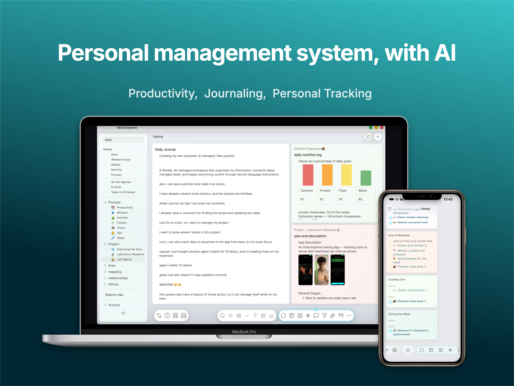</a>
  <p><strong><a href="https://www.youtube.com/watch?v=OBp37eEpNaA">Watch the demo →</a></strong></p>
</div>

## The idea

System App brings notes, knowledge, and responsibilities into one connected workspace. Rich documents hold live tasks, linked information, images, tables, and charts; an integrated AI agent works with that same content, while scheduled workflows keep recurring processes moving.

Built around **capture first, organize later**, the app is designed to reduce mental load: preserve the full context, surface what matters now, and turn information into action without losing where it came from.

## The experience

### A workspace around your life

Build a home for your projects, routines, and knowledge. Topics bring related documents together, with flexible layouts that keep the right context in view. Inside each document, continuous writing flows around tasks, information cards, images, tables, and charts—with formatting and visual styles to make each space your own.

<p align="center">
  <a href="docs/media/workspace-project.png">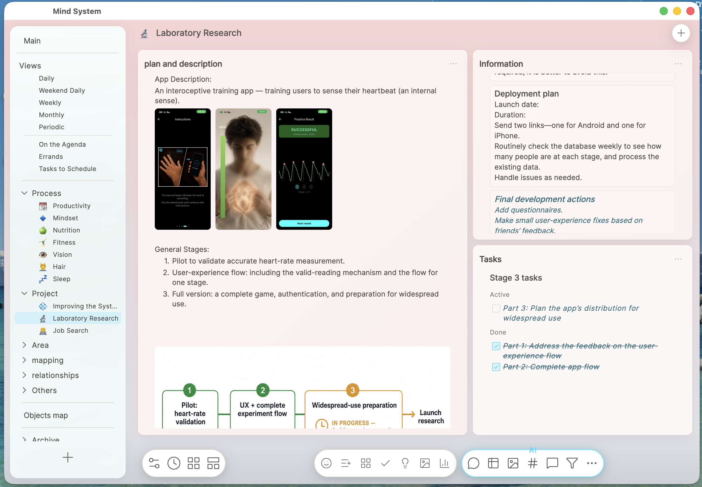</a>
  <a href="docs/media/workspace-mindset.png">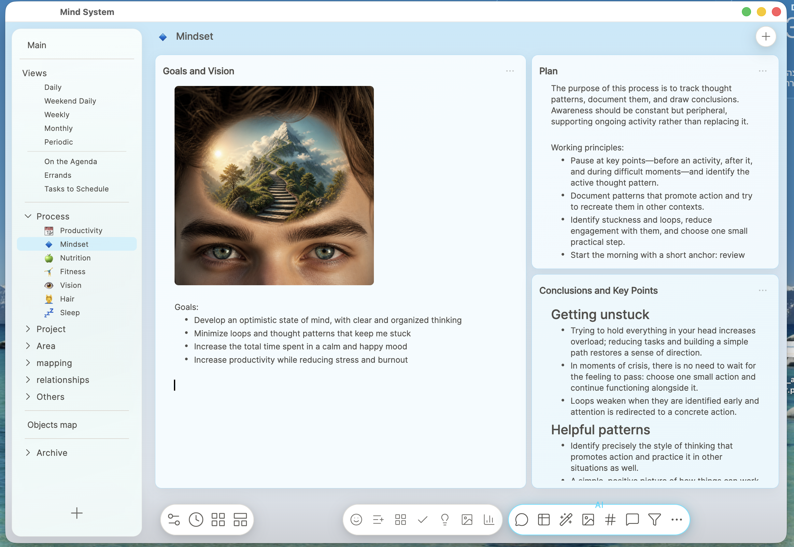</a>
  <a href="docs/media/workspace-life-area.png">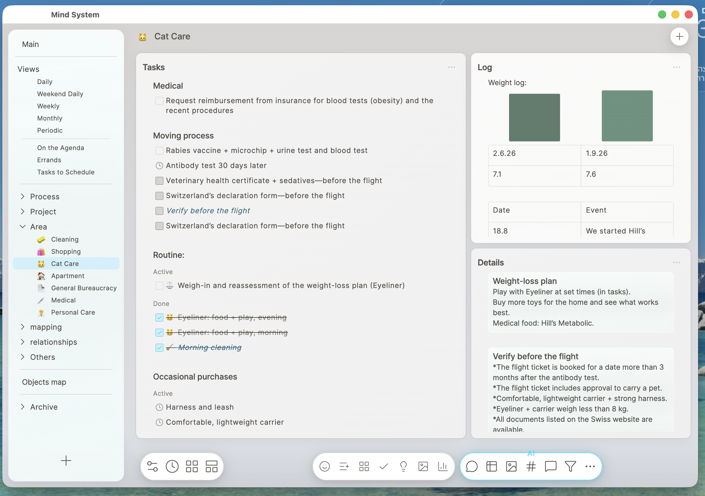</a>
</p>
<p align="center"><sub>Project workspace · Personal process · Life area — click any image to enlarge</sub></p>

### AI actions and an agent that works with your content

**Write a prompt** to ask the agent to find information or update your documents—for example, “Go over all my processes and update the plan and tasks using my notes.” **Create an AI action** to save a recurring instruction with its own name, icon, and shortcut, such as finding the right file for a new note. **Review the diff dialog** to compare current and suggested content and accept or reject individual changes, or choose direct application when running the action.

<p align="center">
  <a href="docs/media/agent-prompt.png">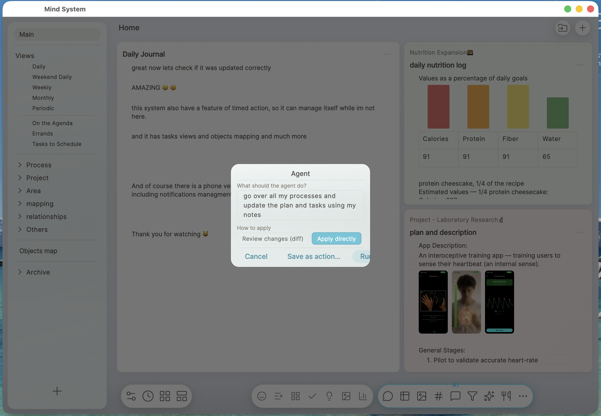</a>
  <a href="docs/media/agent-action.png">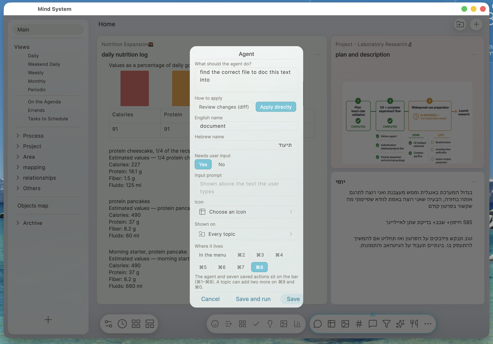</a>
  <a href="docs/media/agent-diff.png">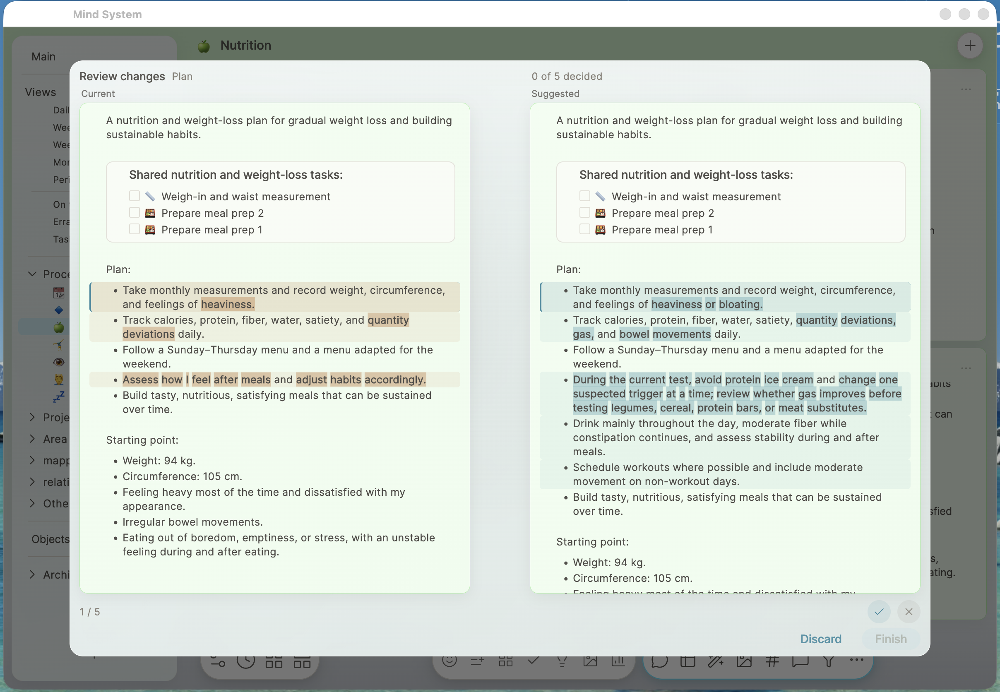</a>
</p>
<p align="center"><sub>Write a prompt · Create an AI action · Review the diff</sub></p>

### More ways to organize and act

**Task views.** Bring tasks from different topics into focused sections for repeating routines and one-time work. Completing a task here updates the same task in its original document.

**Automations.** Schedule ordered workflows that combine AI actions with creating or filling documents, resetting tasks, and archiving files. A weekly process can update plans from your notes and prepare the next review.

**Object mapping.** Explore linked information across documents in an interactive map. Arrange nodes, filter by tags, and open editable cards while keeping every idea connected to its source.

<p align="center">
  <a href="docs/media/task-views.png">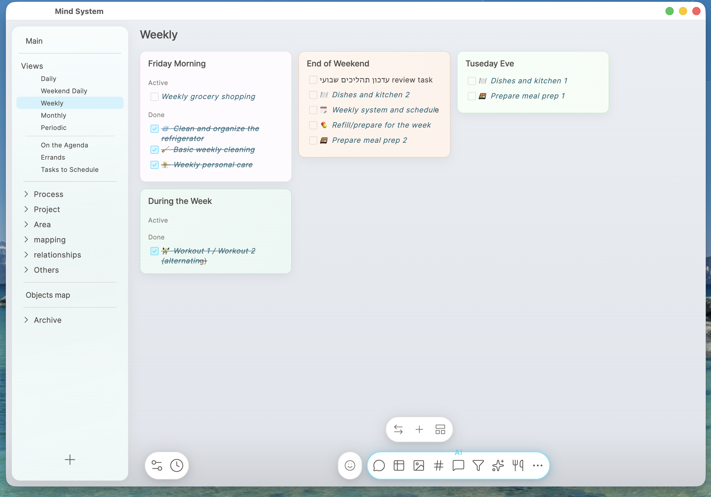</a>
  <a href="docs/media/automations.png">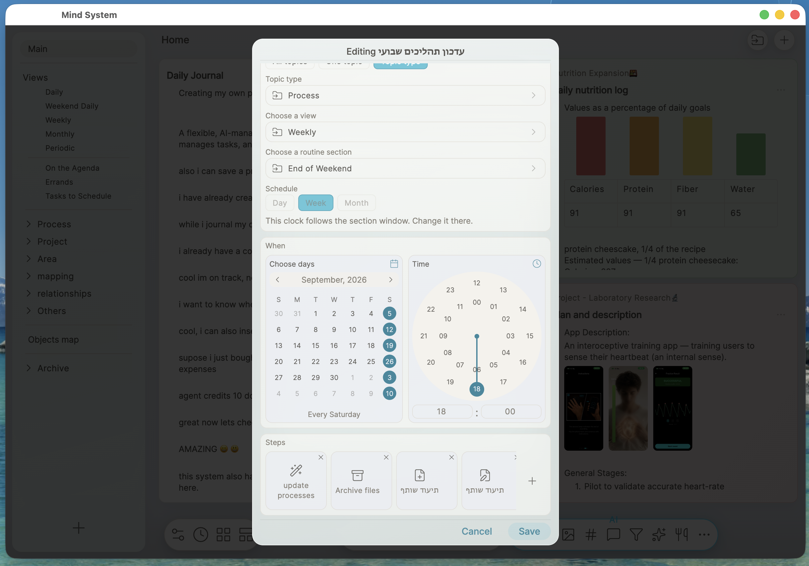</a>
  <a href="docs/media/object-map.png">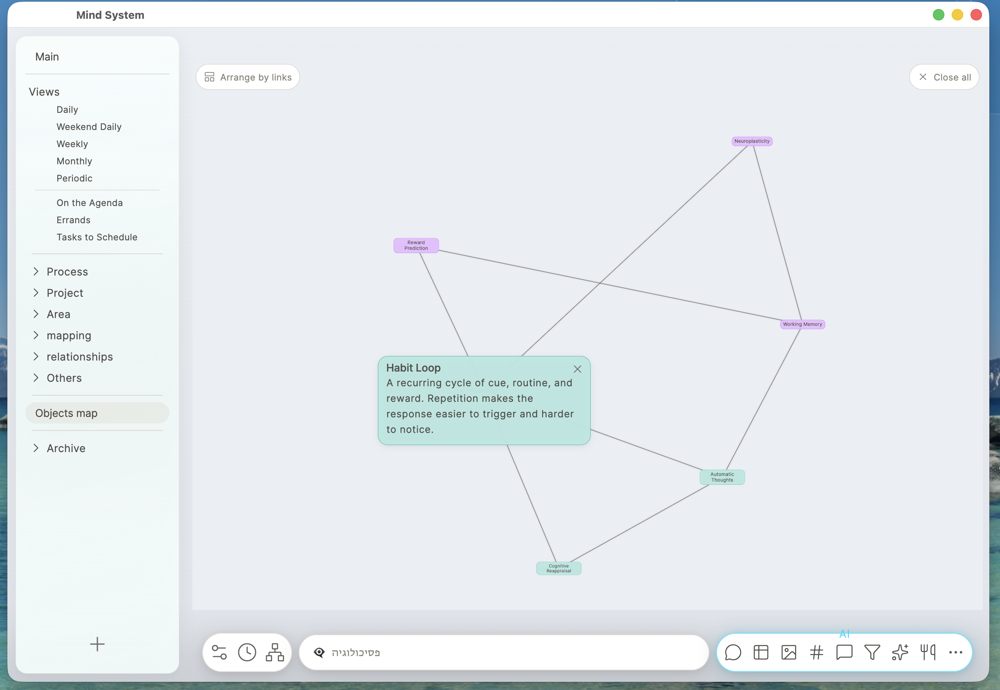</a>
</p>
<p align="center"><sub>Task views · Automations · Object mapping</sub></p>

### On your phone · with notifications

Take the workspace with you through a dedicated iOS interface: drawer navigation, one document at a time, and touch-friendly editing. English and Hebrew support extends across the interface and writing experience.

Section reminders and an app-icon badge surface tasks that need attention. With remote notifications configured, reminders can arrive while the app is closed; the badge reflects the number of sections needing attention and updates as work is completed. The app refreshes current content when you return.

<p align="center">
  <a href="docs/media/phone-documents.png">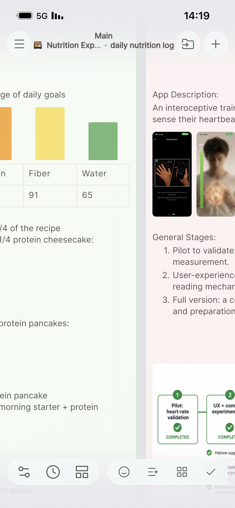</a>
  <a href="docs/media/phone-navigation.png">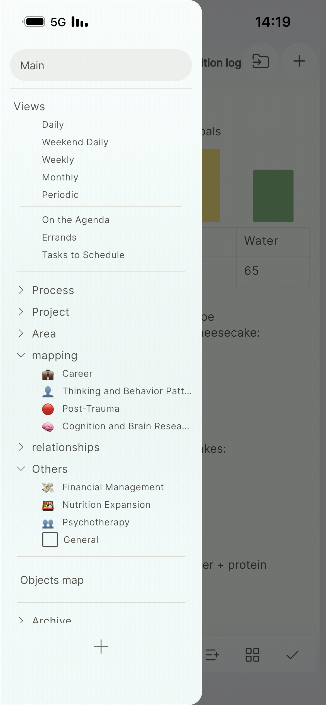</a>
  <a href="docs/media/phone-editing.png">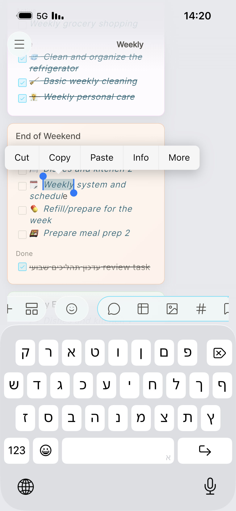</a>
</p>
<p align="center"><sub>Documents on the go · Topic and view navigation · Touch editing</sub></p>

## Architecture

Two views connect the product experience to its implementation. **Blue** represents the client, **purple** application logic and AI, **green** persistent data, and **amber** scheduling or review decisions.

### 1 · System and document architecture

The Flutter client connects to a Flask API organized by product area. PostgreSQL stores the workspace hierarchy and object relationships: documents own text and placement, while embedded objects own their content. Task views reference existing tasks, and knowledge links connect information across files.

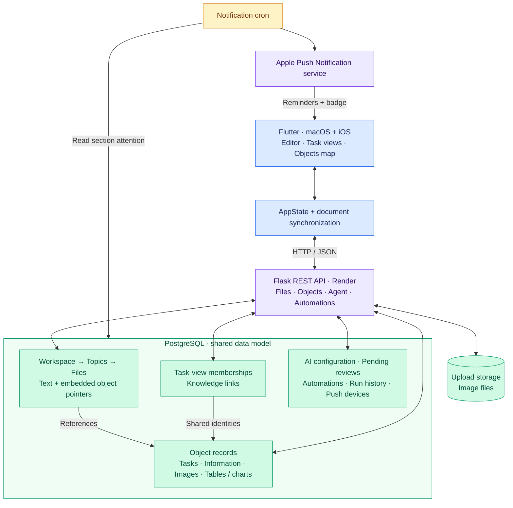

The document synchronization coordinator reconciles local and remote text; revision checks reject stale file writes so the client can fetch and merge again. A separate notification dispatcher delivers section attention through APNs independently of longer-running AI work.

### 2 · AI actions and scheduled workflows

Manual prompts, saved actions, and scheduled AI steps share the same agent pipeline. Automations also run ordinary application operations, in order, with execution history. The configured AI mode determines whether proposed file edits are applied, queued for review, or returned without application.

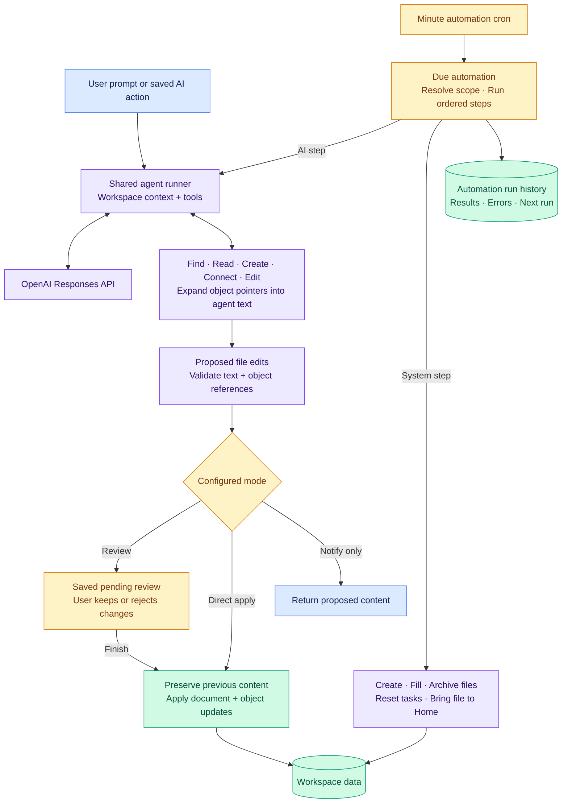

The agent reads expanded document content and writes through a shared validation and apply path. Review presents readable document differences, while archived files remain read-only to the agent. Scheduled steps stop at the first error, retaining earlier results; schedules use Israel local time with the next execution stored in UTC.

## Project structure

- [`system_app_front_end/`](system_app_front_end/) — Flutter client, editor, task views, and responsive application shells.
- [`system_app_back_end/`](system_app_back_end/) — Flask API, SQLAlchemy models, agent tools, and automation runner.
- [`content/`](content/) — versioned production-agent instructions synchronized into the database.
- [`DEVELOPMENT.md`](DEVELOPMENT.md) — development workflow, area map, and documentation index.

Both applications organize code by **files**, **objects**, **production_agent**, and **automations**, with separate **ui** and **ux** areas in the client. Each area has an `AREA.md` documenting its behavior and boundaries.

## Development

The current version is under active development. See [`BACKLOG.md`](BACKLOG.md) for known gaps and [`DEVELOPMENT.md`](DEVELOPMENT.md) for setup and deployment guidance.

With dependencies and backend configuration in place, run each service in a separate terminal:

```bash
# Backend
cd system_app_back_end
python app.py
```

```bash
# Frontend
cd system_app_front_end
flutter pub get
flutter run -d macos
```

Validation commands:

```bash
cd system_app_back_end
python -m pytest
```

```bash
cd system_app_front_end
dart analyze lib
```

For Render, use `system_app_back_end` as the web service root with the existing Gunicorn configuration. A separate Cron Job runs `python scripts/run_automations.py` every minute from that directory; see the [automation documentation](system_app_back_end/areas/automations/AREA.md).

Remote iPhone notifications use a separate minute cron and Apple push credentials; see [notification setup](system_app_back_end/docs/PUSH_NOTIFICATIONS.md).
