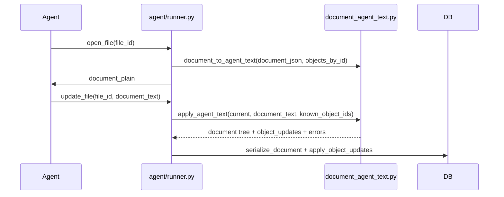

# Production agent — system prompt & document text format

**This file is app content, not backend dev documentation.**

- **Edit here** → sync to `agent_configs.system_prompt` in PostgreSQL
- **Runtime:** the production agent reads the DB row, not this file
- **Sync:** `python system_app_back_end/scripts/sync_agent_prompt.py --overwrite`
- **Coding agent (Cursor):** [`DEVELOPMENT.md`](../../DEVELOPMENT.md)

The **document block tree** in `files.document_json` is the only persisted representation. Agent text is computed on demand and never stored.

## Flow



## Principles

| Principle | Rule |
|-----------|------|
| Source of truth | `document_json` v3 block tree only |
| Serialize on demand | Call `document_to_agent_text()` when opening a file for the agent |
| Deterministic format | Fenced markers for lists, tables, and embedded objects |
| Round-trip | `apply_agent_text()` parses agent text → block tree + object payload updates |
| Safety | Never silently drop embeds; reject updates that omit existing `object_id`s |
| Spans | Agent text is plain text; imported blocks get empty `spans` (formatting is editor-only) |

## Block separators

- **Double newline** (`\n\n`) separates top-level blocks (paragraph, heading, fenced regions).
- **Single newline** inside a paragraph block is preserved in the paragraph `text` field.

## Fenced regions

### Headings

```text
## Goals
```

Markdown-style `#` … `######` prefix (level = count of `#`).

### Bullet list

```text
[BULLET_LIST]
- Item one
- Item two
[/BULLET_LIST]
```

Indent with two spaces per level. Stored as `type: bullet_list`.

### Ordered list

```text
[ORDERED_LIST]
1. Step one
2. Step two
[/ORDERED_LIST]
```

Stored as `type: ordered_list`.

### Table

```text
[TABLE]
Header A	Header B
Value 1	Value 2
[/TABLE]
```

- One row per line; cells separated by tab (`\t`).
- Literal tab or backslash inside a cell: escape as `\t` and `\\`.

### Embedded objects (frozen shapes)

**Task list** — checkbox lines under ACTIVE / DONE:

```text
[TASK_LIST id="42"]
ACTIVE:
- [ ] Call clinic
DONE:
- [x] Done item
[/TASK_LIST]
```

**Info** — first line is **title**, remaining lines are **body**:

```text
[INFO id="17"]
Lens notes
Practice morning and evening.
Track progress weekly.
[/INFO]
```

**Image** — caption and optional url/path ref (single-line marker):

```text
[IMAGE id="5" caption="Screenshot" url="/uploads/shot.png"]
```

**Graph** — optional `chartType`; tab-separated **labels** row, **values** row, optional **colors** row:

```text
[GRAPH id="8" chartType="bar"]
Week1	Week2	Week3
10	20	15
#4A90D9	#E07A5F	#3D405B
[/GRAPH]
```

Preserve every `id="…"` when editing. Never invent object ids.

Use `open_file` to load a file. It returns:

| Field | Meaning |
|-------|---------|
| `document_plain` | Agent text with the fences above |
| `object_extras` | Only when useful — for **info**, optional `title` and **`Links`** |

Each **Links** entry is `{ id, type, title }` (related object or description target). Related peers may also include `file_id`. Do not invent ids; only use ids from tools or scope. Archived files are readable; never write to them.

## Code reference (implementation)

| Module | Role |
|--------|------|
| [`areas/files/services/document_agent_text.py`](../../system_app_back_end/areas/files/services/document_agent_text.py) | Serialize, parse, apply |
| [`areas/production_agent/services/runner.py`](../../system_app_back_end/areas/production_agent/services/runner.py) | Tool dispatch |
| [`areas/production_agent/services/prompt.py`](../../system_app_back_end/areas/production_agent/services/prompt.py) | Load/sync this file ↔ DB |

Document JSON schema: [`system_app_back_end/areas/files/AREA.md`](../../system_app_back_end/areas/files/AREA.md)

Editor UX: [`system_app_front_end/lib/areas/files/AREA.md`](../../system_app_front_end/lib/areas/files/AREA.md)
