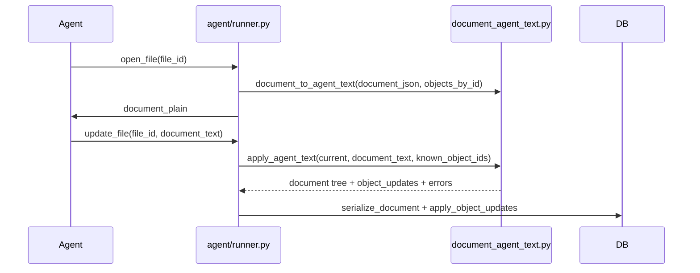

# Production agent — document text format

The **document block tree** in `files.document_json` is the only persisted representation. Agent text is computed on demand and never stored.

## Flow



## Principles

| Principle | Rule |
|-----------|------|
| Source of truth | `document_json` v3 block tree only |
| Serialize on demand | Call `document_to_agent_text()` when opening a file for the agent |
| Deterministic format | Fenced markers for lists, tables, and embedded objects |
| Round-trip | `apply_agent_text()` parses agent text → block tree + object payload updates |
| Safety | Never silently drop embeds; reject updates that omit existing `object_id`s |
| Spans | Agent text is plain text; imported blocks get empty `spans` (formatting is editor-only) |

## Block separators

- **Double newline** (`\n\n`) separates top-level blocks (paragraph, heading, fenced regions).
- **Single newline** inside a paragraph block is preserved in the paragraph `text` field.

## Fenced regions

### Headings

```text
## Goals
```

Markdown-style `#` … `######` prefix (level = count of `#`).

### Bullet list

```text
[BULLET_LIST]
- Item one
- Item two
[/BULLET_LIST]
```

Indent with two spaces per level. Stored as `type: bullet_list`.

### Ordered list

```text
[ORDERED_LIST]
1. Step one
2. Step two
[/ORDERED_LIST]
```

Stored as `type: ordered_list`.

### Table

```text
[TABLE]
Header A	Header B
Value 1	Value 2
[/TABLE]
```

- One row per line; cells separated by tab (`\t`).
- Literal tab or backslash inside a cell: escape as `\t` and `\\`.

### Embedded objects

Existing markers (unchanged):

```text
[TASK_LIST id="42"]
ACTIVE:
- [ ] Call clinic
DONE:
- [x] Done item
[/TASK_LIST]

[INFO id="17"]
Body text
[/INFO]

[IMAGE id="5" caption="Screenshot"]
[GRAPH id="8" title="Chart"]
```

## Implementation

| Module | Role |
|--------|------|
| [`services/document_agent_text.py`](../services/document_agent_text.py) | Serialize, parse, apply, object updates |
| [`services/agent/runner.py`](../services/agent/runner.py) | Tool dispatch; `open_file` / `update_file` |
| [`services/document_v3.py`](../services/document_v3.py) | `document_plain_text()` → `document_to_agent_text()` |

JSON schema and block types: [`DOCUMENT_MODEL.md`](DOCUMENT_MODEL.md).

Editor UX (continuous cursor, formatting): [`../../system_app_front_end/docs/APP_FILES.md`](../../system_app_front_end/docs/APP_FILES.md).
