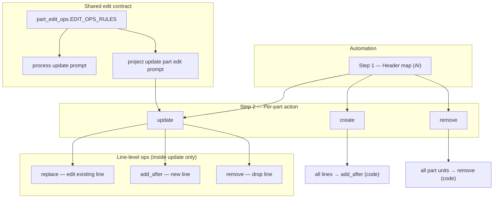
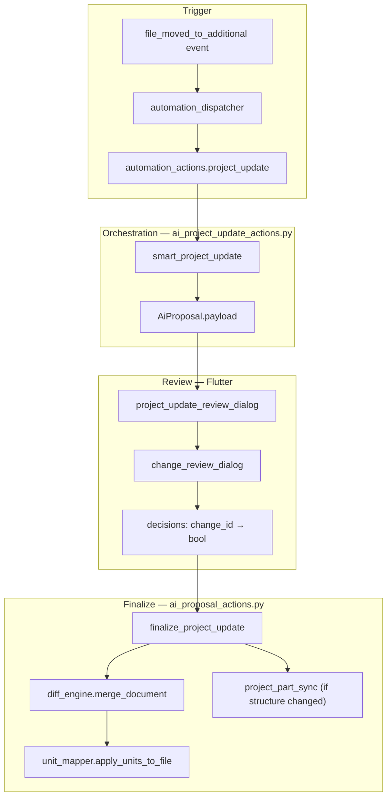
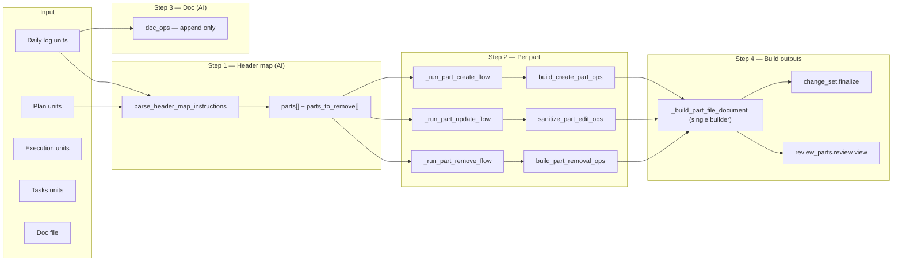
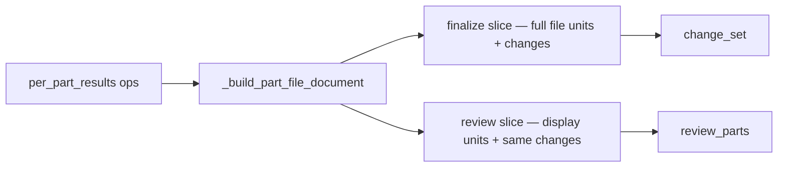

# Project Update Automation — Architecture

Dedicated reference for the `project_update` automation (`smart_project_update`). Use this when fixing review/finalize bugs or changing prompts.

Related: general automation framework in [`automation.md`](automation.md). Change review UI contract in `system_app_front_end/lib/shared/change_review/README.md`.

Process update (`smart_process_update`) shares the same **line-level edit ops** contract for in-place revisions vs new lines — see `services/part_edit_ops.py`.

---

## What it does

When a **daily log** (`text` file) is moved into a **project topic** as an additional file, the automation:

1. Reads the log (sections split by inner `header` blocks).
2. Maps each section to plan parts (create / update / remove).
3. Proposes edits to **plan**, **execution**, and **tasks**.
4. Appends **documentation** rows (auto-applied, no review).
5. Opens a **part-first review dialog** on the project topic.
6. On finalize, archives old files, writes new ones, syncs part headers if structure changed.

**Skipped** if log has no headers → `project_update_skipped` proposal.

---

## Flow hierarchy



| Level | Flow | AI? | Ops source |
| --- | --- | --- | --- |
| **Part** | `create` | 1× content prompt | `build_create_part_ops` — every line is `add_after` |
| **Part** | `update` | 1× part edit prompt | AI returns `plan_ops` / `execution_ops` / `tasks_ops` directly |
| **Part** | `remove` | none | `build_part_removal_ops` — every unit in part is `remove` |
| **Line** (update only) | edit | — | `replace` on existing `unit_id` |
| **Line** (update only) | add | — | `add_after` after anchor `unit_id` |
| **Line** (update only) | drop | — | `remove` on `unit_id` |

**Update path mirrors process update:** one AI call, unit IDs in the prompt, ops out — no content-then-diff step.

---

## System overview



---

## Pipeline (per proposal)



### Step 1 — Header map

| Input | Output |
| --- | --- |
| Numbered `PLAN_HEADERS` `[1] X, [2] Y…` | Sparse `instructions[]` |
| Indexed `LOG_SECTIONS` `[0] A, [1] B…` | `parts[]` (create/update) |
| | `parts_to_remove[]` |
| | `log_date` |

**Code:** `parse_header_map_instructions` in `unit_mapper.py`  
**Prompt:** `PROJECT_UPDATE_HEADER_MAP_PROMPT`

Each instruction becomes a `part_entry` with `action`, `part_name`, `log_section_index`, `log_content`.

Constants: `PART_ACTION_CREATE`, `PART_ACTION_UPDATE`, `PART_ACTION_REMOVE`.

### Step 2 — Per-part flows

| Action | Function | Prompt | Ops |
| --- | --- | --- | --- |
| **create** | `_run_part_create_flow` | `PROJECT_UPDATE_PART_CREATE_PROMPT` | `build_create_part_ops` → all `add_after` |
| **update** | `_run_part_update_flow` | `PROJECT_UPDATE_PART_EDIT_PROMPT` | AI `plan_ops` / `execution_ops` / `tasks_ops` → `sanitize_part_edit_ops` |
| **remove** | `_run_part_remove_flow` | — | `build_part_removal_ops` → all `remove` |

**Update prompt** uses `EDIT_OPS_RULES` from `part_edit_ops.py` — same rules as `SMART_PROCESS_UPDATE_PROMPT`.

**Line op constants:** `LINE_OP_REPLACE`, `LINE_OP_ADD`, `LINE_OP_REMOVE`.

Input for update includes `flatten_part_units_with_ids` (lines with `[unit_id]` prefixes), not bare text arrays.

### Step 3 — Documentation

| | |
| --- | --- |
| Prompt | `PROJECT_UPDATE_DOC_PROMPT` |
| Review | None — auto-applied on finalize from `payload.doc_ops` |
| Ops | `add_row` only |

### Step 4 — Proposal payload

```text
payload
├── change_set          ← FINALIZE reads this
├── review_parts        ← REVIEW UI reads this (same change ids)
├── ai_steps            ← debug (header_map, parts, doc)
├── source_files        ← file ids at proposal time
├── doc_ops
├── plan_structure_changed
└── locale
```

---

## Single builder (review = view of finalize)



`_build_part_file_document` calls `build_document_change_set` **once** per part per file. Review uses different **display units** (create anchor, remove slice) but identical **changes** (ids, actions, unit_ids).

**Rule:** `review_parts[*].plan.changes[].id` and `action` must match `change_set.documents[].changes[]` exactly.

---

## Review UI (Flutter)

| Part action | UX |
| --- | --- |
| **update** | Line-by-line: replace / add (`+`) / remove — same as process update |
| **create** | Line-by-line per section; header auto-approved; **Accept all in section** |
| **remove** | Bundled per section (plan / execution / tasks) |

**Entry:** `project_update_review_dialog.dart` → `change_review_dialog.dart`

---

## Finalize

`finalize_project_update` in `ai_proposal_actions.py`:

1. `merge_document(units, changes, decisions)` per plan / execution / tasks.
2. Archive source files; create new files; `apply_units_to_file`.
3. If `plan_structure_changed`: `sync_execution_and_tasks_to_plan`.
4. Append doc rows from accepted `doc_ops`.
5. Input log stays in additional (not archived).

**Merge semantics** (`diff_engine.merge_document`):

- `replace` — overwrite `unit.text`
- `remove` — skip unit
- `add_after` — append new units **after** anchor `unit_id` in file order

---

## File map

| Role | Path |
| --- | --- |
| Automation entry | `services/automation_actions.py` → `project_update` |
| Orchestration + prompts | `services/ai_project_update_actions.py` |
| Shared edit op rules | `services/part_edit_ops.py` |
| Header map parse | `services/unit_mapper.py` — `parse_header_map_instructions` |
| Create ops | `services/part_diff.py` — `build_create_part_ops` |
| Remove ops | `services/unit_mapper.py` — `build_part_removal_ops` |
| Change set + merge | `services/diff_engine.py` |
| Process update (reference) | `services/ai_proposal_actions.py` — `smart_process_update` |
| Finalize | `services/ai_proposal_actions.py` |
| Review dialog | `lib/features/topic/project_update_review_dialog.dart` |

---

## Debugging a bad proposal

1. `payload.ai_steps.header_map` — create / update / remove classification
2. `payload.ai_steps.parts[].ops` and `op_summary` — replace vs add_after counts
3. Compare `review_parts[i].plan.changes` vs `change_set.documents[plan].changes` — same ids?
4. `decisions` keys must match change ids from **change_set**
5. After finalize, inspect merged file — insert vs replace?

---

## Tests

| File | Covers |
| --- | --- |
| `tests/test_part_diff.py` | `build_create_part_ops`, legacy `build_update_part_ops` |
| `tests/test_part_edit_ops.py` | `sanitize_part_edit_ops`, `summarize_ops` |
| `tests/test_unit_mapper_parts.py` | header map, review/change_set alignment |
| `tests/test_project_update.py` | change_set smoke |

Run: `pytest tests/test_part_diff.py tests/test_part_edit_ops.py tests/test_unit_mapper_parts.py tests/test_project_update.py`

---

## Change checklist

1. Prompt change? → Update this doc + constant in `ai_project_update_actions.py` (or `part_edit_ops.py` for shared rules).
2. New part action? → header map parser + `_run_part_*_flow` + review UI branch.
3. Line op semantics? → `part_edit_ops.py` + both process and project update prompts.
4. Review display? → `_display_units_for_part` only — never re-derive ops.
5. Run tests above.
