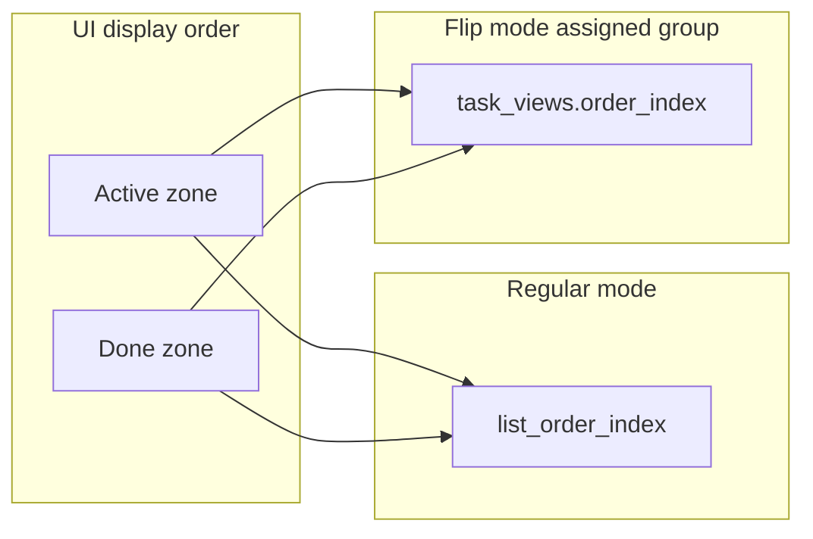
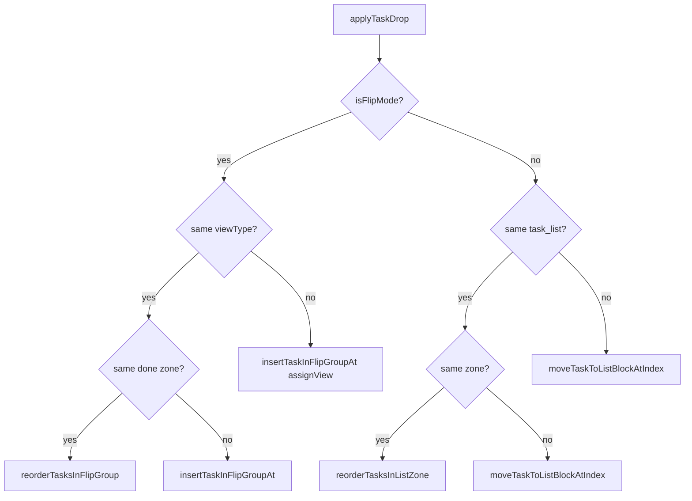

# Topic Task Files

Canonical reference for **tasks-type files** in a topic: list membership, display order, drag-and-drop, flip-by-view mode, create/delete, and how row blocks relate to task rows.

View-pane task UI shares `TaskRow` / `TaskZoneList` but uses different `AppState` entry points — see [`../task_view/README.md`](../task_view/README.md).

Backend persistence and API details: [`../../../system_app_back_end/docs/TASKS.md`](../../../system_app_back_end/docs/TASKS.md).

## Read order for agents

1. This file — topic task file behavior
2. [`README.md`](README.md) — folder index and key files
3. [`../blocks/README.md`](../blocks/README.md) — how `task_list` blocks render in the file editor
4. Backend [`TASKS.md`](../../../system_app_back_end/docs/TASKS.md) — schema, reorder endpoints, delete cascade

## Mental model: four storage layers

Never conflate these. Drag **never** moves `task` row blocks in the file layout.

| Layer | Field / table | Purpose | Updated when |
|-------|---------------|---------|--------------|
| List membership | `tasks.block_id` → `task_list` | Which list owns the task | Create, cross-list move |
| List order | `tasks.list_order_index` | Order within a list (active zone, then done) | Reorder in regular mode; unassigned flip group; cross-zone move in regular mode |
| View order | `task_views.order_index` | Order within a flip assigned view group | Flip same-view reorder; cross-view assign + insert |
| Row anchor | `task` block `order_index` + `content.task_id` | Physical row in the file for focus/editing | **Create and delete only** — not drag |

Migration **016** adds `list_order_index` and backfills from row-block order. It must be applied on the database before list reorder works correctly.

## Editing surfaces

| Surface | Toggle | Widget chain | Order source |
|---------|--------|--------------|--------------|
| Regular | default | `TasksConnectedEditor` → `TaskLinesEditor` → `TaskZoneList` | `list_order_index` per `task_list` |
| Flip by view | `files.settings['tasks_flip_by_view']` | `TasksFlipEditor` → grouped `TaskLinesEditor` | Assigned: `task_views.order_index`; Unassigned: `list_order_index` |
| Legacy fallback | file has `task` blocks but no `task_list` | `TaskBlockWidget` / `TaskRow` per block | block `order_index` |
| View pane | N/A (not a topic file) | `ViewPaneTasksEditor` → same row stack | `task_views.order_index` — see task_view docs |

Flip mode is toggled via `AppState.setFileTasksFlipByView`.

## Block layout

A tasks file contains one or more `task_list` anchor blocks. Each task has:

- A **`tasks` row** (`block_id`, `list_order_index`, `status`, …)
- A **`task` row block** in the file (`content: { "task_id": N }`) for editing focus

Helpers live in [`lib/core/task_file_layout.dart`](../../core/task_file_layout.dart):

| Function | Role |
|----------|------|
| `taskListRegion` | Blocks between this `task_list` and the next |
| `orderedTasksForListBlock` | Sort: status (active first) → `list_order_index` → `id` |
| `groupTasksByView` | Flip UI grouping by view membership |
| `mergedTaskIdsAfterZoneInsert` | Build full list id sequence after zone insert |
| `listInsertIndexForNewTask` | Where to insert a new row block on create |

Row blocks stay in place when the user drags tasks. Only task table / view membership fields change.

## Display order

Within each zone (active or done):

1. `status` — active before done (zones are separate columns in UI)
2. `list_order_index` (regular / unassigned flip) or `task_views.order_index` (assigned flip)
3. `task.id` — tiebreak only

Partitioning: [`lib/core/task_list_order.dart`](../../core/task_list_order.dart) — `partitionTasks`, `partitionTasksById`.

## User actions

| Action | UI | AppState | API |
|--------|-----|----------|-----|
| Enter after row | `TaskRow` / draft row | `createTaskInFileAfter` | `POST /tasks` + row block create; may `POST …/reorder` or flip insert |
| Backspace on empty row | `FormattedTextField` | `deleteTaskInFile` | `DELETE /tasks/:id`; FE deletes row block |
| Toggle done | mark control | `toggleTaskStatus` | `PATCH /tasks/:id` status only |
| Paste lines | `TaskRow` | `pasteTasksInFileAfter` | repeated create |
| Flip toggle | file menu | `setFileTasksFlipByView` | `PATCH /files/:id` settings |
| Drag reorder / move | grip in `TaskZoneList` | `applyTaskDrop` | see drag matrix below |

Create flow (`createTaskInFileAfter`):

1. Insert `task` row block at layout position (after prior row or end of list region)
2. `POST /tasks` attached to `task_list`
3. If inserting after a task: reorder `list_order_index` to match visual position
4. If flip mode with `flipViewType`: assign view + insert in flip group order

Delete flow (`deleteTaskInFile`):

1. `DELETE /tasks/:id` — server cascade removes task, `task_views`, companions; compacts `list_order_index`
2. Frontend deletes the `task` row block
3. Frontend may reorder remaining ids if needed

## Drag and drop

### Classifier (pure)

[`task_drag_data.dart`](task_drag_data.dart) — `resolveTaskDrop` returns a `TaskDropAction`:

- `noop`, `reorder`, `moveAcrossZones`, `moveToListBlock`, `assignView`

No I/O. Covered by [`test/task_drop_resolver_test.dart`](../../../test/task_drop_resolver_test.dart).

### Executor

[`lib/core/app_state_task_file.dart`](../../core/app_state_task_file.dart) (part of `app_state.dart`) — `applyTaskDrop` maps actions to methods below.

Flip-mode drops are serialized through `_runFlipDrag` (queue) so concurrent drags do not corrupt membership order. Errors must propagate (do not swallow with `.catchError`).

### Decision tree

### Action matrix

| Mode | Condition | AppState method | API |
|------|-----------|-----------------|-----|
| Regular | Same list, same zone | `reorderTasksInListZone` → `reorderTasksInListBlock` | `POST /blocks/:id/tasks/reorder` |
| Regular | Same list, cross zone | `reorderTaskAcrossZonesInListBlock` | `POST /blocks/:id/tasks/move` |
| Regular | Cross list | `moveTaskToListBlockAtIndex` | `POST /blocks/:id/tasks/move` |
| Flip | Same view, same zone | `reorderTasksInFlipGroup` | `POST /task_views/reorder` |
| Flip | Same view, cross zone | `insertTaskInFlipGroupAt` | move/assign + `POST /task_views/reorder` |
| Flip | Cross view | `insertTaskInFlipGroupAt` | `PUT /tasks/:id/view` + reorder |

For flip same-view reorder, `reorderTasksInFlipGroup` must use a **fresh** group from `_orderedTasksInView`, not stale `groupTasks` passed from the widget.

### Drag UI

[`task_zone_list.dart`](task_zone_list.dart) — `LongPressDraggable`, drop targets, drag feedback.

- LTR: `pointerDragAnchorStrategy` (ghost follows pointer naturally)
- RTL: use `widget.state.isRtl`, anchor trailing edge at pointer (`Offset(feedbackWidth, 0)`)
- Feedback: glass chip sized to text (`TextPainter`), not full row width

## AppState method map (topic files)

All on `AppState` via [`app_state_task_file.dart`](../../core/app_state_task_file.dart) (`extension AppStateTaskFile`, part of `app_state.dart`) unless noted.

| Method | Responsibility |
|--------|----------------|
| `orderedTasksForFile` | Read sorted tasks for one `task_list` |
| `taskRowBlockInFile` | Find row block for a task |
| `createTaskInFileAfter` | Create task + row block + order |
| `deleteTaskInFile` | Delete task + row block |
| `pasteTasksInFileAfter` | Bulk create from lines |
| `setFileTasksFlipByView` | Toggle flip setting on file |
| `reorderTasksInListBlock` | POST bulk list reorder |
| `reorderTasksInListZone` | Reorder within active or done zone |
| `reorderTasksInFlipGroup` | Reorder within flip group (view or unassigned) |
| `moveTaskToListBlock` / `AtIndex` | Cross-list or cross-zone move |
| `insertTaskInFlipGroupAt` | Assign view + insert at index |
| `applyTaskDrop` | Drag entry point |
| `_runFlipDrag` | Serialize flip drag mutations |
| `_orderedTasksInView` | Tasks in a view sorted by `order_index` |

Shared block-insert helpers stay in main `app_state.dart`: `_createTaskBlock`, `_shiftBlocksForInsert`, `_listInsertIndex*`.

## Invariants (DO NOT)

1. **Do not reorder `task` row blocks on drag** — order lives on `list_order_index` / `task_views.order_index`.
2. **Do not sort display by `task.id`** — use `list_order_index` or view `order_index`.
3. **Do not delete row blocks in `delete_task_cascade`** — frontend owns row block deletion.
4. **Do not filter `section_name IS NULL`** when resolving flip reorder membership unless the client explicitly scopes to a section.
5. **Do not swallow errors in `_runFlipDrag`** — failed reorders must surface to the user / logs.
6. **Do not use `Directionality.of(context)` for drag RTL** — use `AppState.isRtl`.
7. **Do not wrap `FormattedTextField` and its `TextField` in separate `Focus` nodes sharing one `FocusNode`** — chain key handlers after mount for Backspace delete.

## Known pitfalls

| Symptom | Cause | Fix location |
|---------|-------|--------------|
| Delete returns 500 | Missing `delete_task_cascade` import in `routes/tasks.py` | Backend routes |
| Flip same-view reorder silent fail | Stale `groupTasks` or swallowed `_runFlipDrag` errors | `reorderTasksInFlipGroup`, `_runFlipDrag` |
| Flip reorder 400 for sectioned tasks | Backend filtered `section_name IS NULL` | `task_view_order.reorder_task_views` |
| Backspace delete no-op / focus crash | Circular Focus parent on same FocusNode | `formatted_text_field.dart` |
| Hebrew drag ghost off-screen | Wrong RTL anchor sign | `task_zone_list.dart` |

## File index

| File | Role |
|------|------|
| [`task_lines_editor.dart`](task_lines_editor.dart) | Active + done columns |
| [`task_zone_list.dart`](task_zone_list.dart) | Zone list, drag targets, feedback |
| [`tasks_connected_editor.dart`](../blocks/tasks_connected_editor.dart) | Regular mode wiring |
| [`tasks_flip_editor.dart`](tasks_flip_editor.dart) | Flip-by-view grouping |
| [`task_drag_data.dart`](task_drag_data.dart) | Pure drop classification |
| [`../../core/task_file_layout.dart`](../../core/task_file_layout.dart) | Layout + sort helpers |
| [`../../core/task_list_order.dart`](../../core/task_list_order.dart) | Zone partition helpers |
| [`../../core/app_state_task_file.dart`](../../core/app_state_task_file.dart) | `AppStateTaskFile` extension — topic-file mutations |
| [`../../shared/widgets/task_row.dart`](../../shared/widgets/task_row.dart) | Row UI primitive |
| [`../blocks/formatted_text_field.dart`](../blocks/formatted_text_field.dart) | Text editing + Backspace delete |

## Tests

| Test | Covers |
|------|--------|
| [`test/task_drop_resolver_test.dart`](../../../test/task_drop_resolver_test.dart) | `resolveTaskDrop` |
| [`test/task_file_layout_test.dart`](../../../test/task_file_layout_test.dart) | Layout helpers |
| [`test_task_list_order.py`](../../../system_app_back_end/tests/test_task_list_order.py) | List reorder / move |
| [`test_task_view_order.py`](../../../system_app_back_end/tests/test_task_view_order.py) | View reorder |
| [`test_delete_task_cascade.py`](../../../system_app_back_end/tests/test_delete_task_cascade.py) | Delete cascade |

## Extension guide

| Change type | Where to implement |
|-------------|-------------------|
| New pure ordering / grouping logic | `task_file_layout.dart` or `task_drag_data.dart` + unit test |
| New drag outcome | Extend `TaskDropKind` + `resolveTaskDrop`, then `applyTaskDrop` switch |
| New API persistence | Backend `services/task_list_order.py` or `task_view_order.py`, then `TaskService` |
| New UI affordance | `task_zone_list.dart` or `TaskRow`; call existing AppState methods |
| View-pane-only behavior | `app_state.dart` view methods + task_view docs — not this file |

When adding a reorder path, always update **both** the canonical order field and the in-memory cache (`_replaceTasksForListBlock` or `_taskViewMemberships`).
